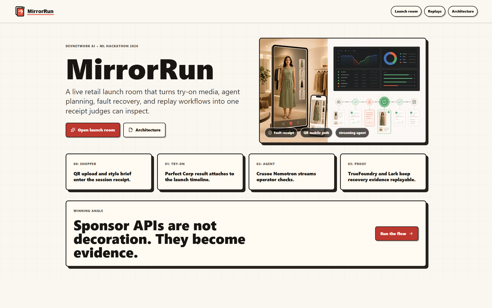
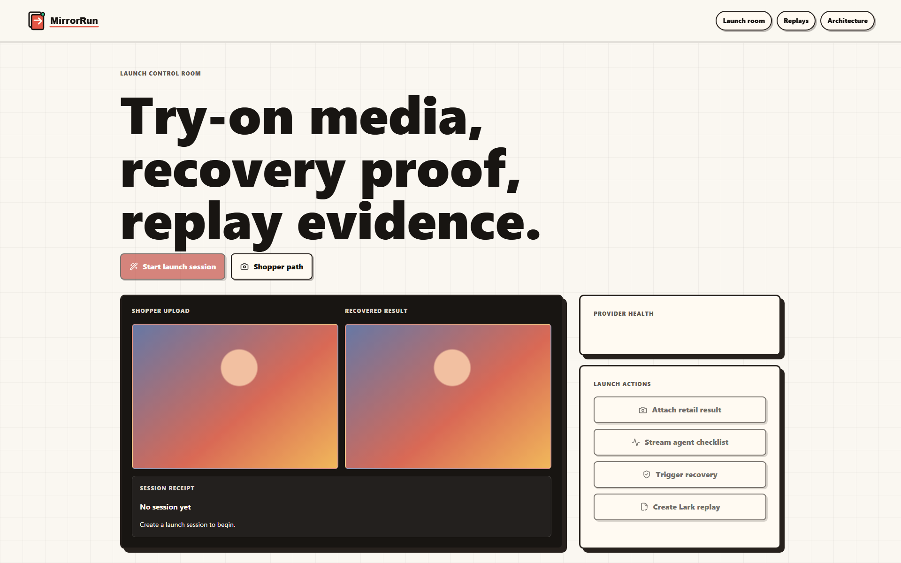
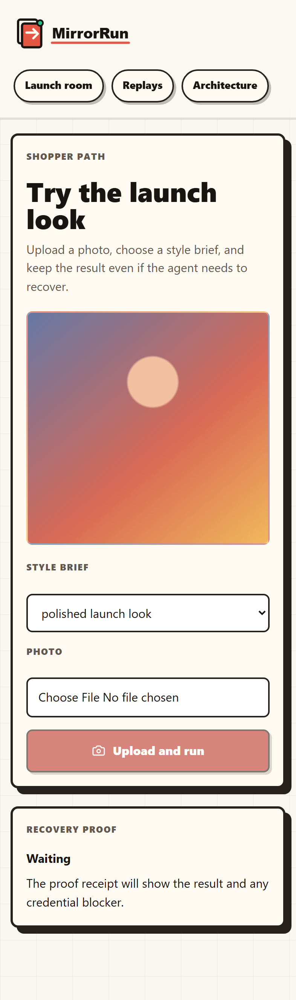
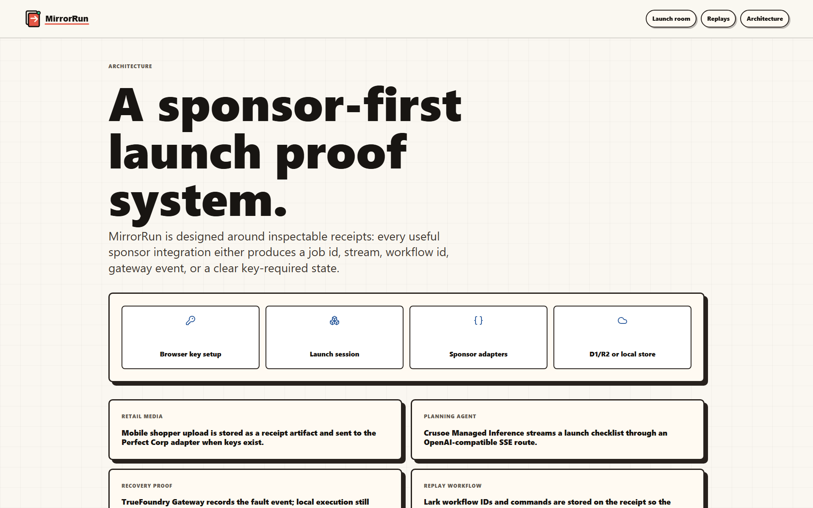
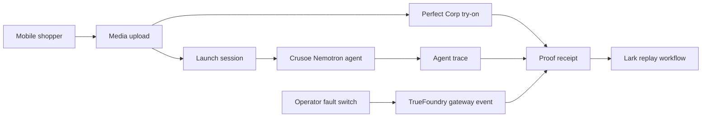

<div align="center">



# MirrorRun

### Launch a retail try-on journey and leave a proof receipt for every failure it survives.

*MirrorRun gives a retail operator the same view a shopper, model provider, try-on API, gateway, and QA workflow see during launch. A session ends with media, trace, recovery, and replay evidence instead of a pretty demo that no one can audit.*

[](#quick-start)
[](./docs/ARCHITECTURE.md)
[](./docs/DEPLOYMENT.md)
[](./LICENSE)

**Quick links:**
[Quick start](#quick-start) ·
[Architecture](./docs/ARCHITECTURE.md) ·
[Deployment](./docs/DEPLOYMENT.md) ·
[中文](./docs/zh/README.md)

</div>

---

## Why MirrorRun Matters

Retail teams can build a beautiful try-on prototype in a day, then lose trust the first time an image job stalls or a model call returns junk. MirrorRun turns that launch risk into something visible: the shopper path, the operator room, the provider checks, the fault switch, and the replay workflow all land in one receipt.

The product is aimed at the moment before a campaign goes live. A merchandiser scans the QR path like a shopper, an operator injects provider trouble, and QA receives a replay workflow that proves the same journey can be checked after the next deploy.

| Launch Question | Usual Demo | Usual Ops Tool | MirrorRun |
| --- | --- | --- | --- |
| Did the shopper path work? | Shows a final image only. | Ignores the consumer moment. | Keeps upload, style brief, result, and session id together. |
| What happened when a provider failed? | Hidden in logs. | Shows alerts without context. | Puts the fault, fallback, and receipt in the launch timeline. |
| Can QA replay it tomorrow? | Someone writes notes. | Separate test tool. | Creates a Lark workflow tied to the exact session. |

## 30-Second Demo

<table>
  <tr>
    <td width="50%"></td>
    <td width="50%"></td>
  </tr>
  <tr>
    <td><b>1.</b> The landing page shows the retail mirror and launch-control split.</td>
    <td><b>2.</b> The operator opens a session, watches provider status, and drives the launch room.</td>
  </tr>
  <tr>
    <td width="50%"></td>
    <td width="50%"></td>
  </tr>
  <tr>
    <td><b>3.</b> The QR/mobile route gives judges a phone-first shopper path.</td>
    <td><b>4.</b> The architecture view explains how sponsor APIs become receipt evidence.</td>
  </tr>
</table>

## Quick Start

```bash
npm install
cp .env.example .env.local
npm run dev
```

Open <http://localhost:3000>, then click **Open launch room**. If another app already owns port 3000, run `PORT=3100 npm run dev` and open <http://localhost:3100>. Without sponsor keys the app still runs, but the try-on, agent, gateway, and workflow panels show exact credential blockers instead of fabricated results.

```bash
npm run typecheck
npm run lint
npm run test:e2e
npm run screenshots
npm run visual:qa
npm run check:submission
npm run combined:check
```

## How It Works



## Decision Matrix

| Decision | Picked | Why | Alternatives Considered |
| --- | --- | --- | --- |
| App runtime | Next.js App Router on Cloudflare Workers | One deploy target for UI, API routes, storage bindings, and streaming routes. | Separate Express API, Vercel-only deploy. |
| Retail API | Perfect Corp YouCam API | The result is shopper-visible and maps to a real consumer journey. | Static sample image, generic image API. |
| Agent | Crusoe Managed Inference with Nemotron | Matches the agent challenge and keeps inference evidence in the receipt. | Local model, generic hosted chat endpoint. |
| Resilience proof | TrueFoundry AI Gateway | The challenge is specifically about behavior during LLM or MCP trouble. | UI-only fault toggle. |
| Replay workflow | Lark CLI/API | Gives QA a concrete workflow artifact after the launch session. | Plain text checklist. |

Full data model and security boundaries live in [docs/ARCHITECTURE.md](./docs/ARCHITECTURE.md).

## Built With

`Next.js App Router` · `Tailwind utility plumbing` · `Mantine` · `Radix Themes` · `Framer Motion` · `lucide-react` · `Cloudflare Workers` · `D1` · `KV` · `R2` · `Playwright`

| Layer | Choice | Notes |
| --- | --- | --- |
| Frontend | Next.js 16, React 19, Tailwind 4 | Product routes, mobile shopper path, and API routes share one app. |
| Visual system | Operational dashboard plus beauty-retail editorial | Dense control-room UI with generated retail imagery and a phone-first route. |
| Storage | Local JSON/media in dev, D1/R2 on Cloudflare | The storage switch is controlled by `MIRRORRUN_STORAGE`. |
| AI | Crusoe OpenAI-compatible endpoint | Server-only key, streamed launch plan, visible blocker when missing. |
| Sponsor workflow | Perfect Corp, TrueFoundry, Lark | Each integration records either real evidence or a precise credential blocker. |
| Testing | Playwright plus HackathonHunter visual QA | Desktop and mobile paths are checked before recording. |

## Bounty Fit

| Track | How MirrorRun Earns It |
| --- | --- |
| Crusoe | Runs the launch planner through the Crusoe Managed Inference contract and records Nemotron output in the receipt. |
| Perfect Corp | Makes the consumer-facing moment a real try-on path, not an internal dashboard. |
| TrueFoundry | Shows what the user sees when model or MCP infrastructure fails and recovers. |
| Lark | Turns a launch session into a replay workflow for developer QA. |
| Overall | Connects concept, progress, and startup feasibility around a concrete retail launch problem. |

## Safety Boundary

- Sponsor secrets stay server-only in `.env.local`, `.dev.vars`, or Wrangler secrets.
- The browser receives status flags, never raw key values.
- Missing credentials are visible as blockers with official setup URLs.
- Uploaded media is stored locally in development and moves to R2 when Cloudflare bindings are enabled.
- Receipt pages expose redacted provider evidence, not raw secret-bearing payloads.

## Repository Layout

```text
.
├── src/app/                 # App Router pages and API routes
├── src/components/          # Launch room, mobile shopper, receipt, status UI
├── src/lib/                 # AI, sponsor actions, storage, config
├── public/brand/            # SVG brand pack and OG card
├── public/art/              # Imagegen retail hero asset
├── tests/e2e/               # Playwright desktop and mobile checks
├── scripts/                 # E2E, screenshots, env, visual QA helpers
├── docs/                    # Architecture, deployment, screenshots, zh mirror
└── pitch/                   # PRD, visual contract, deck/video draft material
```

## License

MIT. See [LICENSE](./LICENSE).
