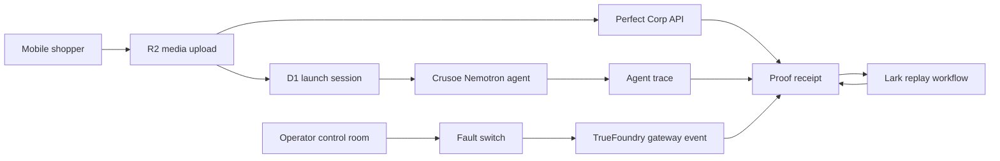

# MirrorRun Architecture

## System Shape
MirrorRun is a Cloudflare-first Next.js app with two synchronized surfaces:

- Shopper surface: `/m/[sessionId]`.
- Operator surface: `/app` and `/app/session/[id]`.

The shopper surface creates retail evidence. The operator surface converts that evidence into launch proof.

## Data Flow

## Core Objects
| Object | Storage | Purpose |
| --- | --- | --- |
| `LaunchSession` | D1 | Stable launch id, status, QR path, timestamps. |
| `ShopperMedia` | R2 + D1 pointer | Uploaded source image and result artifact. |
| `TryOnResult` | D1 + R2 pointer | Perfect Corp job id and result URL/object. |
| `AgentRun` | D1 | Crusoe request metadata, trace events, recommendation. |
| `RecoveryEvent` | D1 | Fault mode, fallback status, gateway evidence. |
| `ReplayWorkflow` | D1 | Lark workflow id, command, run status, artifacts. |
| `ProofReceipt` | D1 view | Combined reviewer-facing receipt for the session. |

## API Routes
| Route | Method | Responsibility |
| --- | --- | --- |
| `/api/sessions` | POST | Create launch session. |
| `/api/media/upload` | POST | Store shopper media in R2. |
| `/api/perfect/try-on` | POST | Call Perfect Corp selected endpoint. |
| `/api/agent/plan` | POST | Stream Crusoe Nemotron planning output. |
| `/api/resilience/fault` | POST | Trigger controlled fault and record recovery. |
| `/api/lark/workflows` | POST | Create or prepare Lark replay workflow. |
| `/api/sessions/[id]` | GET | Return the session receipt data. |
| `/api/config/status` | GET | Report missing credentials without exposing secret values. |

## Sponsor Mapping
- Perfect Corp: consumer-visible try-on result.
- Crusoe: Nemotron Hermes/NemoClaw planning agent.
- TrueFoundry: resilience behavior and gateway proof.
- Lark: replay workflow and developer artifact.

## Deployment
- Runtime: Cloudflare Workers via OpenNext.
- D1 binding: `MIRRORRUN_DB`.
- KV binding: `MIRRORRUN_STATUS`.
- R2 binding: `MIRRORRUN_MEDIA`.
- Secrets: `CRUSOE_API_KEY`, `PERFECT_API_KEY`, `PERFECT_API_SECRET`, `TRUEFOUNDRY_API_KEY`, `GETLARK_API_KEY`.

## Security Boundary
- Sponsor credentials are server-only.
- Uploaded media is referenced by signed or server-proxied URLs.
- Public receipt pages expose only human-readable evidence and redacted provider metadata.
- Raw JSON is available only as a bounded developer drawer or local artifact, never the default UI.
