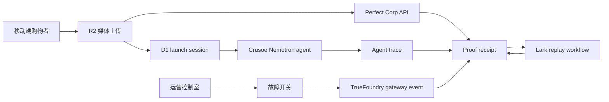

# MirrorRun 架构

## 系统形态

MirrorRun 是一个 Cloudflare-first 的 Next.js 应用，包含两个同步界面：

- 购物者界面：`/m/[sessionId]`。
- 运营界面：`/app` 和 `/app/session/[id]`。

购物者界面产生零售体验证据。运营界面把这些证据整理成上线证明。

## 数据流

## 核心对象

| 对象 | 存储 | 用途 |
| --- | --- | --- |
| `LaunchSession` | D1 | 稳定的上线 id、状态、QR 路径和时间戳。 |
| `ShopperMedia` | R2 + D1 指针 | 上传源图和结果文件。 |
| `TryOnResult` | D1 + R2 指针 | Perfect Corp job id 和结果 URL/object。 |
| `AgentRun` | D1 | Crusoe 请求元数据、trace 事件和推荐内容。 |
| `RecoveryEvent` | D1 | 故障模式、fallback 状态和 gateway 证据。 |
| `ReplayWorkflow` | D1 | Lark workflow id、命令、运行状态和产物。 |
| `ProofReceipt` | D1 view | 面向评审的人类可读综合收据。 |

## API Routes

| Route | Method | 职责 |
| --- | --- | --- |
| `/api/sessions` | POST | 创建 launch session。 |
| `/api/sessions/[id]` | GET | 返回 session receipt 数据。 |
| `/api/media/upload` | POST | 存储购物者媒体。 |
| `/api/perfect/try-on` | POST | 调用 Perfect Corp 选定 endpoint。 |
| `/api/agent/plan` | POST | 流式输出 Crusoe Nemotron 计划。 |
| `/api/resilience/fault` | POST | 触发受控故障并记录恢复事件。 |
| `/api/lark/workflows` | POST | 创建或准备 Lark replay workflow。 |
| `/api/config/status` | GET | 汇报凭证状态，不暴露 secret value。 |

## Sponsor 映射

- Perfect Corp：消费者可见的试穿结果。
- Crusoe：Nemotron Hermes/NemoClaw planning agent。
- TrueFoundry：故障恢复行为和 gateway 证明。
- Lark：复盘工作流和开发者产物。

## 部署

- Runtime：Cloudflare Workers via OpenNext。
- D1 binding：`MIRRORRUN_DB`。
- KV binding：`MIRRORRUN_STATUS`。
- R2 binding：`MIRRORRUN_MEDIA`。
- Secrets：`CRUSOE_API_KEY`、`PERFECT_API_KEY`、`PERFECT_API_SECRET`、`TRUEFOUNDRY_API_KEY`、`GETLARK_API_KEY`。

## 安全边界

- Sponsor 凭证只在服务端使用。
- 上传媒体通过服务端代理或签名 URL 引用。
- 公开 receipt 只展示人类可读证据和脱敏 provider 元数据。
- 原始 JSON 只出现在受控开发者抽屉或本地产物中，不作为默认 UI。
