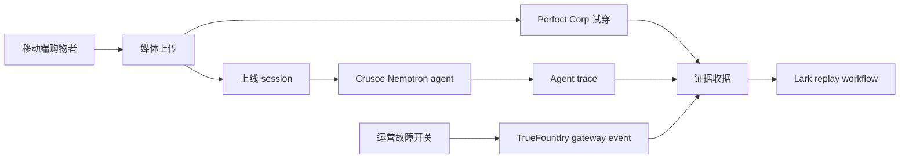

# MirrorRun

MirrorRun 是一个 AI 零售上线验证工具：它让团队启动一次真实的试穿旅程，并为每一次模型、工具或工作流故障留下可审计的证据收据。

## 为什么重要

很多零售试穿 demo 只展示最终图片。真正上线时，图片任务可能卡住，模型可能返回异常，MCP 工具可能报错，QA 也很难复现当时的购物路径。MirrorRun 把这些事情放到同一个上线房间里：移动端购物者路径、运营控制台、供应商状态、故障注入、恢复事件和 Lark 复盘工作流。

| 上线问题 | 普通 demo | 普通运维工具 | MirrorRun |
| --- | --- | --- | --- |
| 购物者路径是否真的可用？ | 只展示最终图片。 | 不关心消费者体验。 | 把上传、风格要求、结果和 session id 放在一起。 |
| 供应商失败时发生了什么？ | 藏在日志里。 | 只有孤立告警。 | 把故障、恢复和收据写进时间线。 |
| 明天 QA 能不能复现？ | 靠人工记录。 | 另开测试工具。 | 直接生成绑定本次 session 的 Lark workflow。 |

## 快速开始

```bash
npm install
cp .env.example .env.local
npm run dev
```

打开 <http://localhost:3000>，点击 **Open launch room**。如果 3000 端口已经被别的应用占用，运行 `PORT=3100 npm run dev` 并打开 <http://localhost:3100>。如果还没有 sponsor key，应用会显示明确的凭证阻塞点，不会伪造 API 成功结果。

```bash
npm run typecheck
npm run lint
npm run test:e2e
npm run screenshots
npm run visual:qa
npm run check:submission
```

## 工作方式



## 技术选择

| 层 | 选择 | 说明 |
| --- | --- | --- |
| 前端 | Next.js 16、React 19、Tailwind 4 | 页面、移动端路径和 API routes 在同一个应用里。 |
| 视觉系统 | 运营仪表盘 + 美妆零售编辑感 | 不是默认 SaaS 模板，而是“试穿镜面 + 上线控制室”。 |
| 存储 | 本地 JSON/media，生产切到 D1/R2 | 由 `MIRRORRUN_STORAGE` 控制。 |
| AI | Crusoe OpenAI-compatible endpoint | server-only key，缺 key 时给出真实阻塞。 |
| Sponsor 工作流 | Perfect Corp、TrueFoundry、Lark | 每个集成都记录真实证据或明确的凭证阻塞。 |
| 测试 | Playwright + HackathonHunter visual QA | 桌面和移动端都在录制前检查。 |

## 关键链接

- 英文 README: [../../README.md](../../README.md)
- 架构文档: [../ARCHITECTURE.md](../ARCHITECTURE.md)
- 部署文档: [../DEPLOYMENT.md](../DEPLOYMENT.md)
- Key 获取记录: [./deployment/KEY_ACQUISITION.md](./deployment/KEY_ACQUISITION.md)
